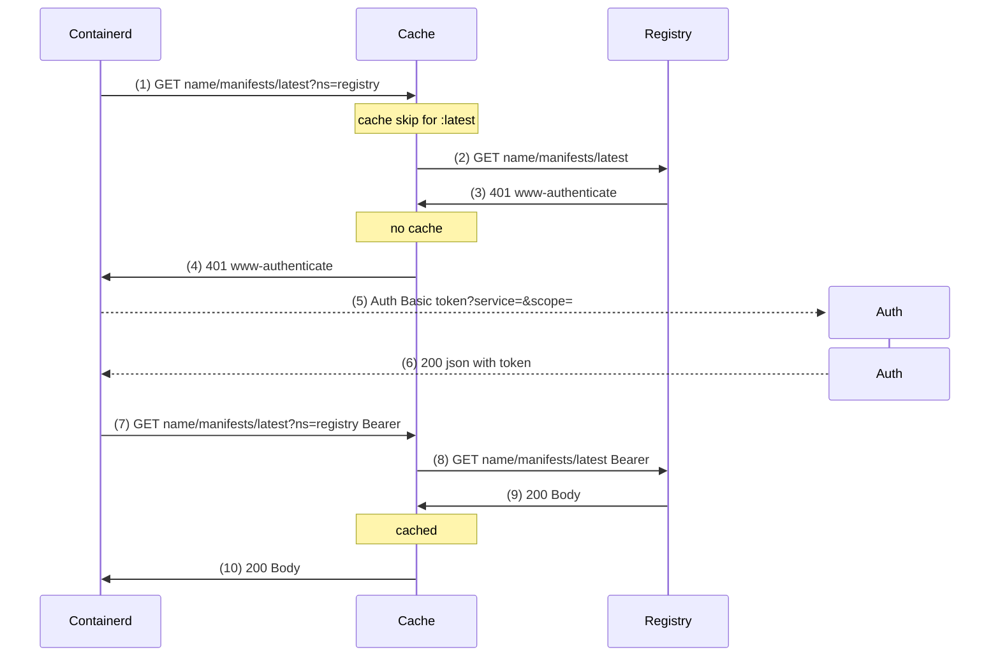

# containerd-registry-cache

A pull-through multi-registry cache for `containerd` in Kubernetes clusters.

### Alternatives
- [jamesorlakin/cacheyd](https://github.com/jamesorlakin/cacheyd) - the original project this fork is based on
- [aceeric/ociregistry](https://github.com/aceeric/ociregistry) - uses stateful disk/memory data, which limits horizontal scaling and high availability
- [k8s-image-swapper](https://github.com/estahn/k8s-image-swapper/) - mutate Pods to a copy of image in ECR, needs access to all cluster Secrets.
- [docker-registry-proxy](https://github.com/rpardini/docker-registry-proxy) - https MITM caching proxy, needs installing trusted CA to all prod hosts.

### How it works
- Starting from `containerd` v1.6.17, mirror registry requests [include](https://github.com/containerd/containerd/blob/v2.1.3/docs/hosts.md#registry-host-namespace) `?ns=<origin>` query argument. This allows to set up `containerd` with a single mirror like so: 
  ```bash
  # check that /etc/containerd/config.toml has this already set:
  [plugins."io.containerd.grpc.v1.cri".registry]
  config_path = "/etc/containerd/certs.d"
  
  # configure default mirror for all registries
  mkdir -p /etc/containerd/certs.d/_default
  cat >/etc/containerd/certs.d/_default/hosts.toml <<EOF
  [host."http://localhost:30123"]
    capabilities = ["pull", "resolve"]
  EOF
  # no need to restart containerd, changes are applied automatically
  ```
- With this setup, running `crictl pull alpine` results in a request like: 
  `http://localhost:30123/v2/library/alpine/manifests/latest?ns=registry-1.docker.io`
- And `containerd-registry-cache`, listening on `localhost:30123`, has information that this specific manifest should be fetched from `registry-1.docker.io`. That allows to use single cache endpoint for different upstream registries.
- In case `localhost:30123` is not available, `containerd` falls back to the original registry

### How to run
Available as a docker image: https://hub.docker.com/r/sepa/containerd-registry-cache
```bash
$ docker run sepa/containerd-registry-cache -h
Usage of ./containerd-registry-cache:
  -b, --bucket string                  Use S3 bucket for cache
  -d, --cache-dir string               Cache directory (default "/tmp/data")
  -m, --cache-manifests                Enable manifests cache (default true)
  -f, --creds-file string              Use credentials file for registry auth
  -l, --log-level string               Log level to use (debug, info) (default "info")
  -p, --port int                       Port to listen on (default 3000)
      --private-registry stringArray   Private registry to skip Manifest caching for (can be specified multiple times)
  -t, --skip-tags string               RegEx of image tags to skip caching (default "latest")
  -v, --version                        Show version and exit
```
Run it as: 
- `Nodeport` service. This way you can access it from any node on `localhost:<port>`, but only after CNI is started. 
- To make it useful for node-init level images too (like CNI), expose in as `Ingress`. Empty non-configured node should be able to make http requests to such address. But you probably want to prevent external requests to your cache.
- In "PVC" (default) mode, cache data is stored in `--cache-dir`. If you want to scale horizontally, each Pod would eventually have all the data. You can shard requests to individual Pods on Ingress level, i.e `ingress-nginx` has this:
  ```yaml
  annotations:
    nginx.ingress.kubernetes.io/upstream-hash-by: "$uri"
    nginx.ingress.kubernetes.io/proxy-next-upstream: error timeout http_500 http_502 http_503 http_504
    nginx.ingress.kubernetes.io/proxy-next-upstream-tries: "3"
  ```
- In "S3" mode, cache data is stored in `--bucket`. That simplifies horizontal scaling, as each Pod has access to all the data. But latency and bandwidth is higher.

### Notes
- Cache volume data could be cleaned up at any time. There is no expiration and built-in auto cleaning. You can implement any cleanup policy in PVC mode via sidecar and `find -del`. In S3 mode, you can use S3 lifecycle rules.
- S3 could be used for storage by specifying `--bucket`. Access should be provided via IRSA or [default envs](https://docs.aws.amazon.com/cli/v1/userguide/cli-configure-envvars.html), which would be checked on startup. Example of overriding S3 endpoint for China:
  ```yaml
  env:
  - name: AWS_ENDPOINT_URL_S3
    value: https://s3.cn-north-1.amazonaws.com.cn
  - name: AWS_REGION
    value: cn-north-1
  ```
  Cache dir is still used in this mode for ephemeral storage during S3 upload
- By default, both Blobs and Manifests (excluding `:latest`) are cached. You can disable Manifests caching altogether (`--cache-manifests=no`), to always re-query all tags (like mutable `:3`, `:3.1`, with immutable `:3.1.2`)
- Blobs are reused across all registries, as they are uniquely "content addressable" by sha256
- Pulls for cached private Manifests require no auth. Use with care for private registries!  
You can specify such registries as `--private-registry` to skip Manifest caching and only cache Blobs. Still, one can download such private Blob from the cache knowing its sha256 without auth. Also, keep in mind that k8s by default does not prevent running a private image already existing on a Node.
- You can use registry credentials via `--creds-file` to avoid dockerHub unauthenticated rate limits for example. File is `yaml` with section names equal to corresponding registry hosts:
  ```yaml
  registry-1.docker.io:
    username: puller
    password: secret1
  ghcr.io:
    username: org-pull
    password: secret2
  ```
- Prometheus metrics are available on `--port` at `/metrics` endpoint:
  ```ini
  containerd_cache_total{result="hit"}  # served from cache 
  containerd_cache_total{result="miss"} # saved to cache
  containerd_cache_total{result="skip"} # not saved to cache due to `--skip-tags` or `--cache-manifests=no`
  ```
- You can use standard `HTTPS_PROXY`/`NO_PROXY` env vars to route requests from the cache to upstream registries, when nodes have no direct access to them (like in China)

### Auth flow
Default auth flow looks like this:

Cache forwards all non-2xx responses (4) as-is, and `containerd` authenticates with the registry directly (5). Then, following responses (9) to requests with Bearer Auth (8) are cached.

By using `--creds-file` option, cache now intercepts 401 responses (4) and tries to authenticate with the registry directly using provided credentials. Only in case the creds are invalid, `containerd` would get 401 and try to authenticate with the registry directly using some own `imagePullSecrets`.

### How to test locally
Docker distribution [API spec](https://distribution.github.io/distribution/spec/api/) example:
```bash
# get manifest
curl -I localhost:3000/v2/kube-scheduler/manifests/v1.29.1?ns=registry.k8s.io
# get first image manifest
curl -i localhost:3000/v2/kube-scheduler/manifests/sha256:019d7877d15b45951df939efcb941de9315e8381476814a6b6fdf34fc1bee24c?ns=registry.k8s.io
# get first blob
curl -i localhost:3000/v2/kube-scheduler/blobs/sha256:aba5379b9c6dc7c095628fe6598183d680b134c7f99748649dddf07ff1422846?ns=registry.k8s.io
# check cache
ls -lh /tmp/data/
```

[Authentication flow](https://distribution.github.io/distribution/spec/auth/token/) example:
```bash
$ curl -I https://registry-1.docker.io/v2/library/alpine/manifests/latest
HTTP/1.1 401 Unauthorized
www-authenticate: Bearer realm="https://auth.docker.io/token",service="registry.docker.io",scope="repository:library/alpine:pull"
# or in case of Basic auth:
# WWW-Authenticate: Basic realm="Registry Realm"

# login with basic auth
$ curl -i 'https://auth.docker.io/token?service=registry.docker.io&scope=repository:library/alpine:pull' [-u user:pass]
{"token": "xxx", ...

# or get anon token
export token=$(curl -s "https://auth.docker.io/token?service=registry.docker.io&scope=repository:library/alpine:pull" | jq -r .token)

$ curl -i -H"Authorization: Bearer $token" https://registry-1.docker.io/v2/library/alpine/manifests/latest 
```

### How to test on a k8s node
This could be useful to see the http requests during pull (`ctr` does the pull)
```bash
ctr image pull --hosts-dir /etc/containerd/certs.d --http-dump docker.io/library/hello-world:latest
```
Or `containerd` makes the pull:
```bash
crictl pull docker.io/library/alpine
# logs are here
journalctl -fu containerd
```
